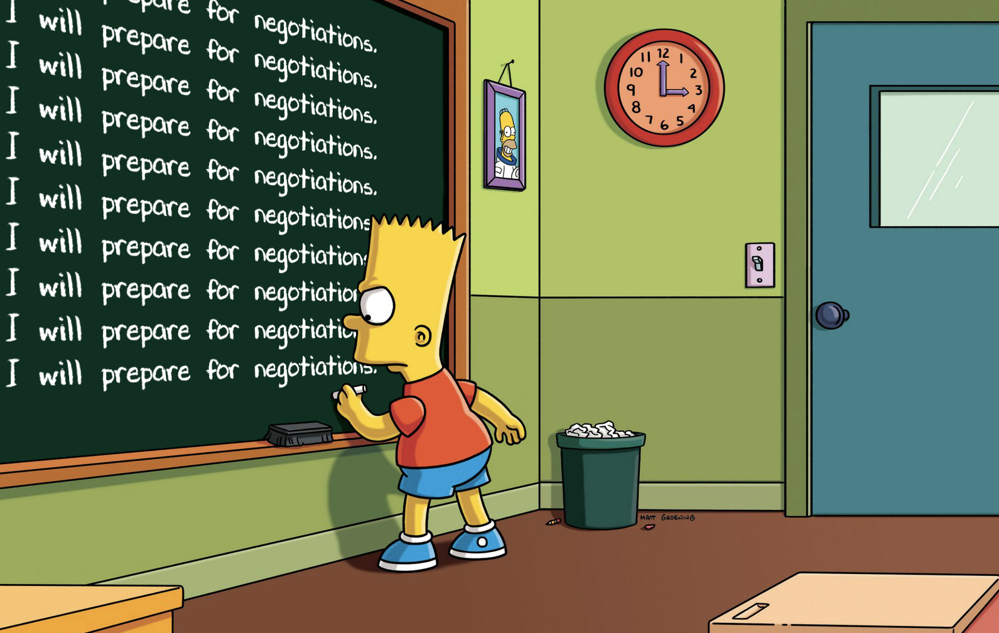

# Thoughts on negotiations based on _Never Split the Difference_ by Chris Voss

Right from the beginning Voss points out the difference between the classic (academic) school of
negotiations and a _"practical"_ approach (_street smart_). He backs his approach with the research
done by Daniel Kahneman and Amos Tversky (see _Thinking Fast and Slow_).

Humans suffer from different biases. We are affected by things such as the _framing effect_ and
_prospect theory_ (see _loss aversion_)

## Become a negotiator

We are easily distracted. We hear what we want to hear. **Due to the _cognitive bias_ we are more
focused on looking for consistency rather than the truth.**

> Most people approach a negotiation so preoccupied by the arguments that support their position
> that they are unable to listen attentively.

> For those people who view negotiation as a battle of arguments, it's the voices in their own head
> that are overwhelming them. When they are not talking, they are thinking about the arguments, and
> when they're talking, they are making their arguments.

🦻 They key to becoming a good negotiator is to be a good listener.

👉 **You need to identify what the other side actually needs.** Get them to feel safe to talk about
it.

🐢 Slow down. Don't fall into the trap of going to fast.

🙊 Voice - Use positive, playful voice. **Relax and smile while talking.** A smile (even when nobody
can see you) affects the tone of your voice. Also, when you are in good mood you tend to think
faster.

Voss distinguishes three types of voices used in negotiations:

1. The _late FP DJ voice_ - Use it to make a point. Keep it calm and slow, with a downward
   inflection. Using this voice you can create an aura of authority without making the other side
   fall to defensive. You will seem to be trustworthy.
2. Positive, playful voice - **This is the default pick.** This is a voice of an easygoing,
   good-natured person. Relax and smile. It should be an encouraging voice.
3. The direct and assertive voice. It's better to use it rarely as it might initiate a push back.

> You can be very direct and to the point as long as you create safety by Dona voice that says
> **_I'm OK, you're OK, let's figure things out_**.

🧠 **Emotions play a crucial part in any negotiation process!** Anybody claiming negotiations are
about rational exchange of arguments is talking moonshine.

### Mirroring (_Isopraxism_)

[Mirroring](https://en.wikipedia.org/wiki/Mirroring)

👉 Imitate and reflect your counterpart. Humans copy each other to comfort each other. Use speech
patterns, body language, tone of voice. This way you and your counterpart will _sync_ and the other
side won't even know that it is happening.

👉 People fear what's different are drawn to what feels familiar.

### Label their emotions

👉 Use **tactical empathy**. Be aware of the _neural resonance_ and try to create it between
parities. Observe other person's body language, tone of voice, words he/she choses.

👉 Imagine yourself being your counterpart. You don't have to agree with the other person but try to
see the world from the other person's position.

> Give someone's emotion a name and that you identify with how that person feels.

> The first step to labeling is detecting the other person's emotional state.

> The trick to spotting feeling is to pay close attention to changes people undergo when they
> respond to external events. Most often, those events are your words.

Once you identified an emotion and named it, say it out loud. You can start by something like:

- _It seems like..._
- _It sounds like..._
- _It looks like..._
- _It gives the impression..._

👉 Labeling is great for defusing your counterpart's fears.

👉 **Pause** - use **silence**. Give the other person time to respond.

👉 Remember that the other person wants to be **understood** and **appreciated**.

### Stay calm and diffuse the negative

👉 Avoid anger. When you are angry your body releases stress hormones, which negatively impacts your
ability to evaluate and respond to situations.

👉 Admit to your mistakes.

> The fastest and most efficient means of establishing a quick working relationship is to
> **acknowledge the negative and diffuse it**.

### Be prepared

### "No" starts the negotiation

Remember that hearing _"No"_ does not automatically indicate a failure. Change _"No"_ as the
opposition of _"Yes"_ to something like _"I'm not comfortable with that"_.

Benefits of _"No"_:

- It brings forth the real issues.
- Slows things down.
- It can help securing the feeling of security in people.

👉 Don't fall into the trap of taking what people say literally!

> (...) everyone you meet is driven by two primal urges: the need to feel safe and secure, and the
> need to feel in control. If you satisfy those drives, you're in the door.

👉 Try to make the other part think that the solution that works for you is their own idea.

### Make the other part say _That's right_. Avoid _You're right_

A good technique to trigger the _that's right_ reaction is tu summarize what has been said.

### Never split the difference

Do not seek a compromise.

👉 Use deadlines to your advantage. Try to learn your counterpart's deadlines and use that knowledge
to gain leverage.

👉 Nobody want's to be accused of being unfair. - _We just want what's fair._ or _I want you to feel
like you are being treated fairly at all times. So please stop me at any time you are being treated
unfair, and we'll address it._

> Your reputation precedes you. Let it perceive you in the way of paves success.

Benefit from the _prospect theory_. People are more likely to take risky decisions when they are
avoiding a loss, thus your goal is to make them think that the approach that you want them to take
will make them avoid a risk of some kind.

> _"I have a lousy proposition, but still I wanted to bring this opportunity to you before I took it
> to someone else."_

1. **Use anchoring**
2. Most of the time you don't want to be the one who makes the first move. Let the other guy go
   first.
3. **Establish a range.** Keep in mind though, that when you establish a range the other side will
   try to come to the lower end.
4. Pivot to non-monetary terms.
5. **Use odd values.**

### People want to feel in control.

👉 Create the illusion of control.

❗️ Avoid questions that can be answered with with a simple _yes_ or _no_. Such questions do not
require your counter part to think.

👉 Ask so called _calibrated questions_. Questions that start with _What_ and _How_. You want to ask
your counterpart for help and engage them into solving your problems. This should give them a
feeling of control and also inspire them to speak at length, potentially revealing more information.

❗️ Avoid asking questions that start with _Why_. _Why_ has an accusatory tone an may inspire your
counterpart to move to a defensive position.

⚠️ Remember, that during any serious negotiations there are always people "behind the table". You
want to find a way to influence them as well.

### You own the execution

> _Yes_ is nothing without _How_.

Remember, that when your organization committed to something, you as a negotiator have to own the
execution. You are responsible for delivering things you agreed upon.

### Use the Rule of Three to spot a lie

When someone answers you with a _yes_ you should want to check if they really mean it. Here cometh
the _Rule of Three_. Use calibrated questions, summaries and labels to force your counterpart to
repeat his/hers _yes_ three times.

> It's really hard to repeatedly lie or fake conviction.

### Learn what TYPE is your counterpart

> (...) Never look at your counterpart as an enemy. The person across the table is never a problem.
> The unsolved issue is. So focus on the issue.

👉 Identify your counterpart's personality type. Is he/she a:

- Analyst?
- Accommodator?
- Assertive?

### Ackerman model

Ackerman model is a rule of thumb that can help you during the bargaining process.

> 1. Set your target price.
> 2. Set your first offer at 65% of your goal price.
> 3. Calculate three raises of _decreasing increments_ (eg. 85%, 95%, 100%)
> 4. Use a lot of empathy and different ways of saying "no" to get the other side to counter before
>    you increase tour offer.
> 5. When calculating the final offer use precise, non-round numbers.
> 6. On your final offer throw in a non-monetary offer (that they probably don't need) to show that
>    you are on your limit. Notice that the increments are decreasing. This is supposed to show your
>    counterpart that you are being squeezed.

### Black Swan

The term _black swan_ used by Voss comes from the _black swan theory_. To quote
[Wikipedia](https://en.wikipedia.org/wiki/Black_swan_theory):

> The black swan theory (...) is a metaphor that describes an event that comes as a surprise, has a
> major effect, and is often inappropriately rationalized after the fact with the benefit of
> hindsight.

As Voss puts it:

> Black Swans are just a metaphor, of course. Think of Pearl Harbor, the rise of the Internet, 9/11,
> and the recent banking crisis. None of the events above were predicted - yet on reflection the
> markers were all there, It's just that people weren't paying attention.
>
> These _unknown unknowns_ are Black Swans.

👉 Get _backup listeners_ - people who are your backup ears. They will catch all those things that
you'll miss.

👉 Review everything you hear. You won't get everything the first time. If there is more than you on
your side go through it together - compare your notes, exchange your observations.

👉 We trust people that we view as being similar. Show the other person that you understand their
problem. Again... **use empathy**.

👉 Try to learn things about the other person.

When the other side starts making decisions that make you say _that's crazy_ or _that's
unreasonable_, it's most likely that you or the other side are missing some information. Perhaps
they are miss-informed, or they are constrained by something?

> Your job when faced with someone like this in a negotiation is to discover what they do not know
> and supply that information.

👉 **If you can, make sure that you can meet in person and get some face time.**
