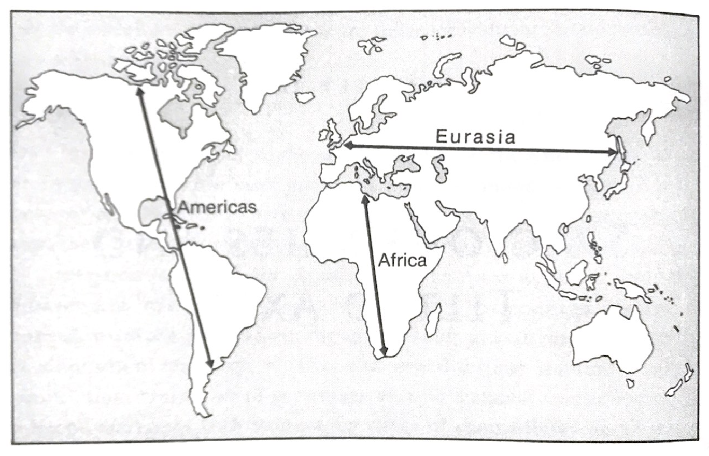

# Guns, Germs, and Steel ¬– notes

These are my notes on a book by Jared Diamond titled _“Guns, Germs, and Steel – The Fates of Human
Societies”_. These notes are rather informal and contain quotes from the book.

Book begins with the author’s conversation with Yali, a New Guinean politician in which they discuss
the obvious differences in technology between Yali’s people and the Europeans that colonized New
Guinea. Finally Yali asks: _“Why is it that you white people developed so much cargo and brought it
to New Guinea, but we black people had little cargo of our own?”_

The author realizes that we could ask a more general question. Why did the rate of progress differ
so much for cultures on different continents?

- Human history, as something separate from the history of animals, began around 7 million years ago
  (estimates range from 5 to 9 million). The first human ancestor to spread beyond Africa was Homo
  erectus. There were fossils found in Java (southeast Asia) that date around 1 million years old.
- The first stone tools apreared 2 million years ago but they were very crude.
- Homo sapiens emerged from Homo erectus around 300,000 to 500,000 years ago.

IMAGE OF HUMAN MIGRATIONS

## Ultimate Factors vs Proximate Factors

Diamond uses the colonization of Americas by the Spanish as an example of the result of different
rates of progress on different continents. Why did Spanish conquistadors conquer the Inca Empire and
not the other way around? We can easily name a set of immediate factors that rendered Europeans as
victors. Diamond uses the [capture of Atahualpa](https://en.wikipedia.org/wiki/Battle_of_Cajamarca)
(the emperor of the Inca empire) by Francisco Pizarro in 1532. Pizarro’s people were able to capture
the emperor and conquer his empire despite the fact that the local forces were much more numerous.

The immediate reasons for Pizzaro’s success:

- Military technology based on **guns, steel weapons, and horses**
- **Infectious diseases** epidemic in Eurasia
- European maritime technology
- The **centralized political organization** of European states

The authors is not satisfied with these reasons as they are only **proximate reasons**. One might
ask a question of why weren’t the Incas the ones that invented guns and steel swords, didn’t mount
animals like horses, and did not bear diseases to which Europeans lacked resistance.

## The rise of food production

**Until around 13,000 years ago all humans lived as hunter gatherers.**

> “Availability of more consumable calories means more people. Among the wild plant and animal
> species, only a small minority are edible to humans or worth hunting or gathering. Most species
> are useless to us as food, for one or more of the following reasons: they are indigestible (like
> bark), poisonous, low in nutritional value, tedious to prepare (very small nuts), difficult to
> gather, or dangerous to hunt. Most biomass on land Is in the form of wood and leaves, most of
> which we cannot digest.
>
> By selecting and growing those few species of plants and animals that we can eat, so that they
> constitute 90 percent rather than 0.1 percent of the biomass on an acre of land, we obtain far
> more edible calories per acre. As a result, one acre can feed many more herders and farmers –
> typically 10 to 100 times more – than hunter gatherers. The strength of brute numbers was the
> first of many military advantages that food-producing tribes gained over hunter-gatherer tribes.”

Largest of domestic animals increased food production by pulling plows and allowed humans to till
land that had been uneconomical for farming. Animals used to pull plows were: cow, horse, water
buffalo, Bali cattle, yak.

Plant and animal domestication led to denser human populations by the pure fact of greater yield of
food produced but also indirectly. For instance, sedentary lifestyle led to shortened birth
interval. _“The birth interval for many farm peoples is around two years, half of that of hunter
gatherers.”_

**Settled existence allowed people to store the surpluses of food. These surpluses are necessary for
feeding the non-food-producing specialists. When the food can be stockpiled it is possible for a
political elite to emerge and gain control over the produced food.** They can then introduce taxation
and completely escape the need to produce food for themselves.

> “Hence moderate-sized agricultural societies are often organized in chiefdoms, and kingdoms (…).
> Those complex political units are much better able to mount a sustained war of conquest than is an
> egalitarian band of hunters.”

**Stored surpluses of food can feed professional soldiers, priests (“who provide. Religious
justification for wars of conquest”), craftsmen (artisans), and scribes.**

Big domesticated mammals became the main mean of transport until 19th century.

### Domesticated species were subject to artificial selection

Darwin in the first chapter of “On the Origin of Species” gives an account of how domesticated
plants and animals arose through artificial selection by humans.

_“(…) principals of crop development by artificial selection still serve as our most understandable
model of the origin of species by natural selection."_

### Apples or Indians

- Out of the 200,000 wild plant species, only a few thousand are eaten by humans, and just a few hundred
  of them have been domesticated.

- A dozen species account for 80% of the annual tonnage of all crops.

> "Our failure to domesticate even a single major new food plant in modern times suggests that
> ancient peoples really may have explored virtually all useful wild plants and domesticated all the
> ones worth domesticating."

Considering that there are so few major crops in the world it should not be surprising that there
are areas without any wild native plants with potential for domestication.

[Fertile Crescent](https://en.wikipedia.org/wiki/Fertile_Crescent) was probably the first center of
food production in the world.

Advantages of the Fertile Crescent:

- Mediterranean climate - Plants had to adapt to long, hot, and dry summers. Many plants in that
  region adapted to that climate in a way that rendered them useful for humans. That is especially
  true for species of cerias and pluses – they are annuals. **During their one-year long life these
  plants remain small herbs and many of them put most of their energy into producing big seeds.**
  These seeds stay dormant during the dry season and are able to quickly sprout when the rains come.
- Studies have shown that the wild ancestors of crops from Fertile Crescent were already highly
  productive, abundant, and occurring in large stands. _"The wild ancestors of our wheat and barley
  crops look so similar to crops themselves that the identity of the ancestor has never been in
  doubt. Because of this ease of domestication, big-seeded annuals were the first, or among the
  first, crops developed not only in the Fertile Crescent but also in China nad the Sahel. Contrast
  this quick evolution of wheat and barley with the story of corn, the leading crop of the New
  World."_ Teosinte (wild ancestor of corn) is much less productive. It had to undergo big changes
  to become worthy investment.
- Fertile Crescent flora has a high percentage of hermaphroditic "selfers" (plants that pollinate
  themselves). Out of 8 crops that have been domesticated in the Fertile Crescent all were
  "selfers".

Why other areas with Mediterranean climate (e.g. South Africa, Chile, Southwest Australia,
California) failed to achieve similar results?

- Western Eurasia has the largest zone of Mediterranean climate
- Greater climatic variation from season to season. This favoured the evolution of annual plants and
  led to a high percentage of such species in the Fertile Crescent.
- Wide range of altitudes and topographies within a short distance.
- A biological diversity over small distances contributed to a greater number of ancestors of crops
  and domesticable animals.

**World Distribution of Large-Seeded Grass Species** (p. 135):

| Area               | Number of Species |
| ------------------ | :---------------: |
| Mediterranean zone |        32         |
| East asia          |         6         |
| Sub-Saharan Africa |         4         |
| North America      |         4         |
| Mesoamerica        |         5         |
| South America      |         2         |
| Northern Australia |         2         |

> (...) local failures or limitations of food production cannot be attributed to competition from
> bountiful hunting opportunities.

**The available pool of species with potential for domestication was responsible for the late or
early start of food production.**

### Domesticable animals

- There are examples that show that the same few suitable wild species of animals attracted the
  attention of many different human societies.
- The domestication of big mammals started with sheep, goad, and pig and ended with camel. There
  have not been any new addition since 2500 B.C.
- There was a very unequal distribution of big mammals suitable for domestication.

> In all, of world's 148 big wild terrestrial herbivorous mammals – the candidates for domestication
> – only 14 passed the test.

- **Diet** – In is inefficient to domesticate a carnivore for food. This is why most domesticated
  animals were either herbivore or omnivore.
- **Growth Rate** - domesticates must grow quickly or else they are not worth keeping.
- **Problems of Captive Breeding** - There are animals that do not breed in captivity.
- Nasty Disposition
- Tendency to Panic
- **Social Structure** - _"Almost all species of domesticated large mammals prove to be ones whose
  ancestors share three social characteristics: they live in hers, they maintain well-developed
  dominance hierarchy among herd members; and herds occupy overlapping home ranges rather than
  mutually exclusive territories."_ This structure can is important so that members of a herd do not
  fight constantly with each other. It is also a ideal for domestication as humans take over the
  dominant role in the hierarchy.

> Cats and ferrets are the sole territorial mammal species that were domesticated, because (...)
> [they were not] raised for food but to keep them as solitary hunters or pets.

_"Australia and the Americas lost most of their candidates in a massive wave of late-Pleistocene
extinctions."_ It is likely that these extinction were caused by humans, when these animals were
exposed to humans when our hunting skills were already developed.

## Axes of diffusion

Diamond argues that a major factor that made diffusion of technology Eurasia more efficient compared
to other continents is the east-west axis. The Americas span 14.5 thousand kilometers north to south
and only 4.8 thousand kilometers east to west in the widest point. Thus the north-south axis of
Americas is much greater than its east-west axis. A similar thing could be said about Africa.
Eurasia on the other hand has a great east-west axis.

This is important because when traveling east to west the climate does not change that greatly which
makes it easier to spread production of crops that were domesticated in a particular climate (range
of temperatures, similar diseases, rainfall).

In the book it is illustrated by showing how quickly food production diffused from the Fertile
Crescent to western Europe. Food production stared in the Fertile Crescent around 8000 B.C. Greece,
Cyprus, and India were reached around 6500 B.C., Egypt around 6000 B.C., central Europe by 5400
B.C., and southwester Spain by 5200 B.C. The "Fertile Crescent package" (foods that originated in
the Fertile Crescent) penetrated African continent and reached Ethiopia. Ethiopia also developed its
own package of indigenous crops. Not all pieces of the Fertile Crescent package spread to all of
those regions (e.g. Egypt was too warm for einkorn wheat) and in some of those indigenous foods were
also farmed but most of food production depended of Fertile Crescent domesticates.

There's evidence that show that most of Fertile Crescent's founder crops were never domesticated
again elsewhere after their original domestication.

> However, for most of the Fertile Crescent's founding crops, all cultivated variates in the world
> today share only one arrangement of chromosomes out of the multiple arrangements found in the wild
> ancestor; or else they share only a single mutation (out of many possible mutations) by which the
> cultivated varieties differ from the wild ancestor in characteristics desirable to humans. For
> instance, all cultivated peas share the same recessive gene that prevents ripe pods of cultivated
> peas from spontaneously popping open and spilling their peas, as wild pea pods do.

A similar argument could be made for domesticated animals as they also are adapted to
latitude-related features of th climate.

In Africa Fertile Crescent's founder crops reached Egypt and then south to Ethiopia but they did not
spread further south than that. African agriculture south from Sahara desert was started by the
domestication of plant indigenous to the Sahel zone and tropical West Africa. A similar
climate-barrier blocked the spread of domesticated animals. Cattle, sheep, and goat reached reached
South Africa some time between 1 and 200 A.D. - 8000 years after it was domesticated in the Fertile
Crescent.

For similar reasons spread of domesticated plants and animals in Americas was also very difficult if
not impossible. It can be proved that in America plants were domesticated independently.
Genetic studies showed that Fertile Crescent crops derive from only a single domestication process.
Their spread was so quick that it preempted any other domestication of related or the same species.
In contract to that, in Americas it was found that some corps come from related species or
completely genetically distinct varieties of the same species. This shows that food production
started independently in different parts of Americas.

## Lethal gift of livestock

Increased food production meant that larger groups of people could be fed and thus resulted in more
densely populated societies - on average 10 to 100 times higher compared to hunter gatherers. Farers
lead a sedentary lives and thus live amid their own sewage. Farming populations often use their own
excrements as fertilizer. In conditions like that it's much easier to for microbes to infect new
victims pollute drinking water.

> (...) when human population became sufficiently large and concentrated, we reached the stage in
> our history at which we could at last evolve and sustain crowd diseases confined to our own
> species. But that conclusion presents a paradox: such diseases could never have existed before
> then! Instead, they had to evolve as new diseases. Where did those new diseases come from?

By molecular studies of the disease causing microbes, scientist found evidence that many of the
microbes responsible for our diseases are closely related to agents of crowd infectious diseases
confined to different species of domestic animals.

> Hence, when we domesticated social animals, such as cows and pigs, they were already afflicted by
> epidemic diseases just waiting to be transferred on us.

| Human disease | Animal with most closely related pathogen                   |
| :------------ | :---------------------------------------------------------- |
| Measles       | cattle                                                      |
| Tuberculosis  | cattle                                                      |
| Smallpox      | cattle (cowpox) or other livestock with related pox viruses |
| Flue          | pigs and ducks                                              |
| Pertussis     | pigs and dogs                                               |

> Evidence has recently been emerging from molecular studies of the disease causing microbes
> themselves. For many of the microbes responsible for our

The reason diseases like measles are called "crowd diseases" is that they require larger population
to sustain themselves. With these epidemic diseases you either die or develop immunity. In order for
the disease to sustain itself there has to be enough new hosts (babies) born. Only food producing
societies could fed such populations this large.

It is estimated that North America was populated by 20 million people when Columbus reached the New
World in 1492. Within two centuries 95% died. Most of them due to diseases brought by the Europeans.
This is perhaps the most well known example but eurasian germs played role in decimating natives in
many different parts of the world e.g. Pacific islanders, Aboriginal Australians, Khoisan peoples of
southern Africa.

> There is no doubt that Europeans developed a big advantage in weaponry, technology, and political
> organization over most of the non-European peoples that they conquered. But that advantage alone
> doesn't fully explain how initially so few European immigrants came to supplant so much of the
> native population of the Americans and some other parts od the world. That might not have happened
> without **Europe's sinister gift to other continents - the germs evolving from Eurasians' long
> intimacy with domestic animals**.

## Importance of writing
