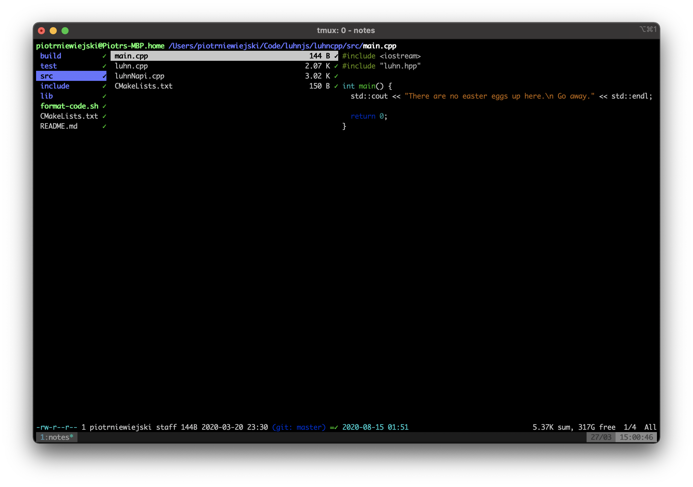

# Command line, a neglected tool which you should master

## Why should you care? 🤷‍♂️

## How to become more effective with command line ❓

In this paragraph I’d like to show you a few utilities and concepts that may make your life easier.
This isn’t meant to be a complete introduction to any of these tools but rather an aggregation of
things that you may want to try and see on your own if that floats your boat. Keep in mind that this
is a very subjective list and something that works for me might not be the best choice for you.

### Improve your experience

#### Change your shell 🐚

When you first open your terminal application you’ll most likely see a _boring_ prompt and your
shell will most likely be [bash](<https://en.wikipedia.org/wiki/Bash_(Unix_shell)>). (If you’re
using
[MacOs Catalina or later your default shell will be ZSH](https://www.theverge.com/2019/6/4/18651872/apple-macos-catalina-zsh-bash-shell-replacement-features).)
Bash is great and you certainly should make an effort to learn how to make a good use of it. It is
the most popular shell which means that if you ever ssh into some remote server, chances are you’ll
be welcomed by bash.

However, I think that you can benefit much more from using alternative shells. There are a few
alternatives available such as zsh, fish, ksh, etc. Today I’d like to focus on zsh because that’s
the one I’m using. There’s a number of features that make zsh great such as recursive path
expansion, spell checker, and much customisation. For me the greatest part is the zsh community
around the Oh-My-Zsh project: https://github.com/ohmyzsh/ohmyzsh.

I encourage you to setup oh-my-zsh on your machine. It offers a broad selection of
[themes](https://github.com/ohmyzsh/ohmyzsh/wiki/Themes). Not only are they aesthetically appealing,
they often provide you with much more information than just your working directory path. For
instance, if you are a git user, you can pick a theme which will prompt you your current branch, if
you have some unstated changes, etc.

A great thing about oh-my-zsh are the **plugins**. To add a plugin you simply have to enable it in
your `~/.zshrc`. Whatever technology you’re using you’ll find something appropriate. See the full
list at: https://github.com/ohmyzsh/ohmyzsh/wiki/Plugins. Some technology/language unrelated plugins
that I’d like to recommend are:

- `zsh-autosuggestions` - History based autosuggestions. See:
  https://github.com/zsh-users/zsh-autosuggestions
- `z` - Allowed you to quickly jump to recently visited directories
- `colored-man-pages` - Make your man-pages more readable with the use of colours
- `fzf` - This plugin enables fzf (more on that later).

#### Terminal emulator

Oh and by the way... Did I say _terminal application_? By that I obviously meant a **terminal
emulator** that you have installed on your computer. It's worth to mention that depending on the
platform you use, there are plenty of different emulators out there that you may want to try. If you
are on the Mac you should definitely switch the default terminal app to
[iTerm2](https://iterm2.com). Trust me, you ain't gonna regret it. I happen to work a lot with Linux
and to be honest the GNOME Terminal works OK and I never felt that I'd like to replace it. For
Windows users there are several alternatives but what I would recommend is to set up WSL (Windows
Subsystem for Linux). This way you may benefit from all the cool stuff that Mac and Linux users have
access to.

#### Finding things with no effort 🔎

Speaking of [fzf](https://github.com/junegunn/fzf)! For me **fzf** (fuzzy command line finder) must
be the most often used command line utility. It makes searching for files, history entries, hosts,
and processes so much easier.

### Do more than one thing at a time and never loose a session – terminal multiplexing

Let me start be describing two problems:

**Problem A:** Imagine a day in life of a software developer. You open your terminal emulator, a
window pops up and shell prompt is presented. You start doing you _thing_. Perhaps you run some
utility, or install dependencies, or execute some script, or compile a project. Then you need to do
another thing but that script you started a minute ago haven't finished yet. There were numerous
situations where I wanted to be able to have several shell sessions running at the same time. Often
I'd like to have two shell visible so that I can see both of them. In other words, **I'd like to
have a tool that will allow me to have multiple shell sessions running simultaneously and an
interface to easily switch between them.**

This problem is partially solved by modern terminal emulators like iTerm2 which allow you to create
tabs/panes and switch between them.

**Problem B:** Imagine working on something in the terminal. Let's say that you do some time
consuming compilation and you accidentally close the terminal emulator's window. In a situation like
that you'd have to start all over again. You can imagine a similar scenario where you work on a
remote machine (via ssh) and the connection drops. As a result your session is terminated and you
have to start from scratch.

I usually have several things running at the same time - opened up several directories, a build or a
test suit running here and there, a connection to a remote server or an instance of
[k9s](https://github.com/derailed/k9s) monitoring a kubernets cluster. I hate having to spent extra
seconds opening that up after closing my terminal window.

In other words, **I'd like to have a tool that will provide a kind of persistance of my shell
session** so that when I close the terminal emulator's window or my ssh connection drops I won't
lose it.

**Problem C:** You can also imagine a case similar to problem B where you have some remote machine
(e.g. a web server that you maintain) to which you connect from your office desktop and your laptop.
Let's say that you did some work when connected from your office desktop and you'd like to preserve
that shell session when you later on connect from you laptop.

**Tmux** is a solution for the above problems. To be perfectly honest, each time I open a terminal
on my computer, I start a new tmux session (or attach to an existing one). When using tmux your
machine runs a process we call the "tmux server" which can have numerous sessions. You can detach
from a session without losing its state. This is why tmux is a great solution for problems B and C.
It can save you your work and it will definitely save you some time.

👉 If you have a set of directories/programs that you want to open/start each time you start
working, with tmux you can even automate that.

🎨 If you're into the whole terminal aesthetic vibe you can configure the color theme and make it
display whatever information you need.

🚨 One point that I have to make is that the learning curve is steep. Basically, to get started you
have to memorize several key combinations (which you can configure).

### Managing files 🗂

For navigating around the file system most of us probably use the default file manager that comes
with the OS - Finder (Mac), File Explorer (Windows), Nautilus (Linux if you use GNOME). Are there
any command line alternatives that are worth mentioning?

More "seasoned" command line users probably used Midnight Commander (or its DOS predecessor Norton
Commander). I know people who still use it today. For me however, it never seemed convenient enough
and I'd always `alt + tab` to my default file manager window 🙈.

It changed when I discovered [ranger](https://github.com/ranger/ranger)! Ranger is very convenient
and really simple. It supports VIM bindings so if you have any vim experience you will feel at home.
Like MacOS's Finder, ranger has a rich _file preview_ feature. It is easily configurable through
config files in `~/.config/ranger/`. You can set it up to display useful information like the status
of your git repository, etc. Checkout ranger's
[official user guide](https://github.com/ranger/ranger/wiki/Official-user-guide).

## Master your tool

Truth be told, when you want to learn something you have to invest some time and effort. We cannot
learn kung fu like Neo in Matrix. I'd like to share here a few articles which I found informative:

- Linux Productivity
  Tools](https://www.usenix.org/sites/default/files/conference/protected-files/lisa19_maheshwari.pdf)
- [The art of command line](https://github.com/jlevy/the-art-of-command-line)
- [Mastering Vim Quickly](https://jovicailic.org/mastering-vim-quickly/) - this book helped me learn
  vim.
